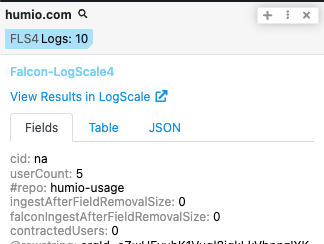
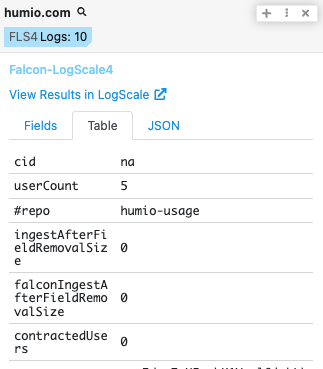
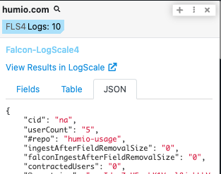

# Polarity Falcon LogScale Integration

CrowdStrike Falcon LogScale is an AI-native SIEM and log management platform, offering real-time threat detection.

Polarity's Falcon LogScale integration allows a user to connect and search a Falcon LogScale instance with a customized search string.

To learn more about LogScale, visit the [official website](https://www.crowdstrike.com/products/next-gen-siem/falcon-logscale/).

  
  

  

## Falcon LogScale Integration Options

## Falcon-LogScale Integration Options

### Falcon LogScale URL
The base URL for the Falcon LogScale Instance including the schema (i.e., https://)

### Personal API Token
Your Personal API Token.  Profile Icon -> Manage your account -> Personal API token

### Repository Names
A comma delimited list of Falcon LogScale repositories you want to search. To view your repositories click the Falcon Icon in the upper left of the dashboard.

### LogScale Query
The query string that will be used to get log data from across the repositories that were entered in the 'Repositories' user option. The default is: "{{ENTITY}}" | tail(10), this will return the 10 latest logs.

### Start of Search Window
How far back you wish to return logs from. #years, #months, #days, or #hours. This option defaults to `7days`.

Below is a table of the accepted values and relative time units:

| Time Unit    | Accepted Values                       |
| ------------ | ------------------------------------- |
| Milliseconds | millisecond, milliseconds, millis, ms |
| Seconds      | second, seconds, s, sec, secs         |
| Minutes      | minute, minutes, m, min               |
| Hours        | hour, hours, h, hr, hrs               |
| Days         | day, days, d                          |
| Weeks        | week, weeks, w                        |
| Months       | month, months, mon                    |
| Quarters     | quarter, quarters, q, qtr, qtrs       |
| Years        | year, years, y, yr, yrs               |

## Installation Instructions

Installation instructions for integrations are provided on the [PolarityIO GitHub Page](https://polarityio.github.io/).

## Polarity

Polarity is a memory-augmentation platform that improves and accelerates analyst decision making. For more information about the Polarity platform please see:

https://polarity.io/
