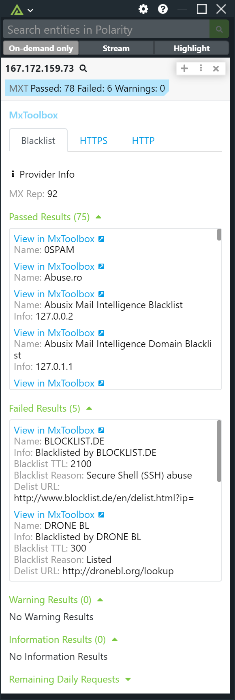

# Polarity Falcon LogScale Integration

CrowdStrike Falcon LogScale is an AI-native SIEM and log management platform, offering real-time threat detection.

Polarity's Falcon LogScale integration allows a user to connect and search a Falcon LogScale instance with a customized search string.

To learn more about LogScale, visit the [official website](https://www.crowdstrike.com/products/next-gen-siem/falcon-logscale/).

## Falcon LogScale Integration Options

### Falcon LogScale URL

The base URL for the Falcon LogScale instance including the schema (i.e., https://)

### Repositories

A comma delimited list of Falcon LogScale repositories with the associated API tokens. This the list of repositories that will be queried in the Falcon LogScale instance. The list is a string in this format: repository_1:token,repository_2:token.

### Search Query

The query string that will be used to get log data from across the repositories that were entered in the "Repositories" user option. The defaul is: \"{{ENTITY}}\" | tail(10), this will return the 10 latest logs.

### Start Of Search Window

Earliest time to search for logs. This option defaults to 7 days. Below is a table of the accepted values and relative time units:

| Time Unit    | Accepted Values                       |
| ------------ | ------------------------------------- |
| Milliseconds | millisecond, milliseconds, millis, ms |
| Seconds      | second, seconds, s, sec, secs         |
| Minutes      | minute, minutes, m, min               |
| Hours        | hour, hours, h, hr, hrs               |
| Days         | day, days, d                          |
| Weeks        | week, weeks, w                        |
| Months       | month, months, mon                    |
| Quarters     | quarter, quarters, q, qtr, qtrs       |
| Years        | year, years, y, yr, yrs               |

## Installation Instructions

Installation instructions for integrations are provided on the [PolarityIO GitHub Page](https://polarityio.github.io/).

## Polarity

Polarity is a memory-augmentation platform that improves and accelerates analyst decision making. For more information about the Polarity platform please see:

https://polarity.io/
